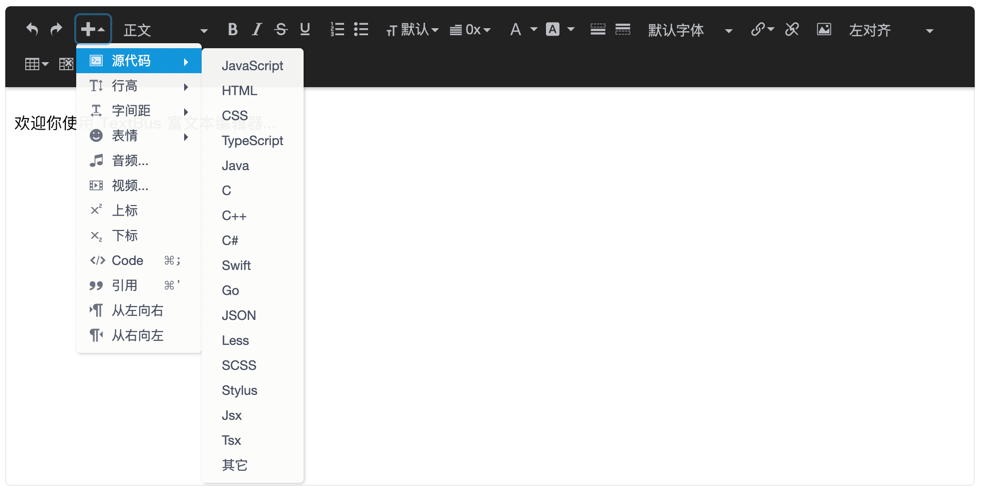

<h1 align="center">Textbus</h1>

🚀 Textbus 是一个组件化、跨平台、数据驱动的富文本框架，并坚定的支持在线**多人协作**。使用 Textbus 你可以轻松创建出类似钉钉文档、石墨文档、飞书文档等完全自定义的编辑器。

<p align="center">
  
  
  
</p>


> 如果你还在使用 1.0 版本，源代码请访问 [Textbus 1.*](https://github.com/textbus/textbus-1.0)
>

## 官方文档

[Textbus 官方文档](https://Textbus.io)

介绍
-------------------------------------------------------------

我们一直致力于让富文本开发也能像普通前端框架一样，通过简明易懂的 api 和少量的约定，即可扩展出健壮的、符合预期的富文本编辑器。在 Textbus 1.0 的时，我们为此做了非常多的探索和努力，取得了不错的成果，但也因为如此，1.0 的设计在某些方面还留下一些遗憾。

幸运的是，Textbus 2.0 已经到来，我们在 1.0 的成果之上，重新设计了整个架构，致力于更简洁的 api，更友好的开发接入方式。

+ 重新设计了组件系统，去掉了大家难以理解的装饰器，改为用类似 vue 的 setup 形式开发组件，并提供了一系列的 hooks 供大家定制交互行为
+ 重新设计了数据模型，可根据用户的操作生成特定的底层原子命令，这让细粒度的历史记录和文档协同成为可能
+ 核心架构脱离了具体平台，让 Textbus 的能力不仅限于在 PC 端，通过编写特定的中间层，可以方便的在移动端，甚至小程序上实现丰富的富文本能力
+ 重写了渲染层，现在 Textbus 2.0 大多数情况下更新视图仅需要 0.2ms 时间，比 1.0 性能更好



### 模块

|          模块          | 作用                                                                                    |
|:--------------------:|:--------------------------------------------------------------------------------------|
|    @textbus/core     | 核心模块，提供了组件、插槽、格式、属性的数据模型抽象和选区、格式变换、渲染、组件生命周期管理、编辑器控制、历史记录、快捷键管理、语法糖管理、输出转换等富文本核心能力的实现 |
|   @textbus/browser   | 浏览器支持中间层，提供了基本的视图层，桥接了选区、光标、和 DOM 渲染能力                                                |
| @textbus/collaborate | 协作支持模块，提供了基于 Yjs 的协作对接能力                                                              |
|   @textbus/editor    | 官方实现的一个简易的编辑器，提供了基本的文档编辑能力                                                            |

### Textbus 的特点

+ [x] **组件化**：根据富文本的特点而专门开发的组件化系统，让富文本编辑支持复杂布局，插入特殊控件等就像现代前端框架一样，非常的简单。
+ [x] **完全可控**：由于 Textbus 采用完全的数据驱动，输入输出完全依赖内核来完成，在不同的浏览器上，不会存在不一样的行为和结果。
+ [x] **易扩展**：hooks 风格的扩展代码，让你在不同上下文中对同样事件定制不同的行为变得异常简单。
+ [x] **语法粮支持**：高度灵活的语法糖支持，你可以非常灵活的定制输入实时转换功能，如 Markdown 中的 # 号 + 空格变为标题等，你也可以完全自创语法，只要你开心。
+ [x] **格式兼容**：完全可定制的文档解析能力，可以让你最大可能的保持从网页、word 等其它页面复制过来的内容和格式。
+ [x] **格式限制**：既可以做到组件深层次嵌套，也可以做到像现在大多数编辑器一样 block 化。
+ [x] **转换便捷**：内置功能强大的格式转换能力，这也是富文本的难点之一，尤其是对于支持树状数据结构的编辑器来说，要实现这一点非常复杂。
+ [x] **高性能**：高性能的渲染器和 jsx/tsx 支持，高性能意味着打开超长文档、超大文档不容易卡顿，jsx 的支持意味着编写复杂布局和复杂交互的组件更容易。
+ [x] **支持在线协作**：Textbus 官方目前提供了基于 Yjs 的协作能力支持，你也可以采用其它的协作方案来对接 Textbus 的数据模型。
+ [x] **高度抽象**：完全抽象的光标和选区系统，你不需要再关心浏览器复杂的选区问题。

### 3.0 预览
+ [ ] node 中间层实现
+ [ ] 移动端中间层实现
+ [ ] 功能更完善的编辑器组件


## 安装

Textbus 可能通过两种方式引入到你的项目中。

### 通过 npm 安装
```
npm install @textbus/core @textbus/browser @textbus/editor
```
在 DOM 中准备好一个空的标签
```html
<div id="editor"></div>
```

创建编辑器实例

```ts
import '@textbus/editor/bundles/textbus.min.css';
import { createEditor } from '@textbus/editor';

const editor = createEditor()
editor.mount(document.getElementById('editor'))
```


### 通过 script 标签引入

```html
<!DOCTYPE html>
<html>
<head>
  <link rel="stylesheet" href="/path/textbus.min.css">
  <script src="/path/textbus.min.js"></script>
  <title>Textbus 示例</title>
</head>
<body>
<div id="editor"></div>
<script>
  var editor = textbus.editor.createEditor()
  editor.mount(document.getElementById('editor'))
</script>
</body>
</html>
```

### 设置默认内容

```ts

const editor = createEditor({
  content: '<p>这里是默认内容</p>'
})
```

## 常用方法

### 销毁编辑器
```ts
editor.destroy()
```

### 获取焦点
```ts
editor.focus()
```

### 取消焦点
```ts
editor.blur()
```

### 获取 HTML 内容
```ts
const content = editor.getContents().content
```

### 获取 JSON 内容
```ts
const json = editor.getJSON().content
```

### 替换内容
```ts
editor.replaceContent('<p>新内容！</p>')

editor.replaceContent({
  // 必须为 Textbus 导出的 JSON 格式
})
```

### 清空编辑器
```ts
editor.replaceContent('')
```
## 本地开发

Textbus 采用 lerna 作为多模块管理，全局安装 lerna。

```
npm install lerna -g
```

克隆 Textbus 仓库，并安装依赖。

```
git clone git@github.com:textbus/textbus.git
cd textbus
lerna bootstrap --hoist
```

启动开发环境。

```
npm start
```

## 联系我们

如果在官网还不能找到你想了解的问题，你可以加入 Textbus 的官方 QQ 群：786923770。你也可以直接扫码加入：


## 赞助

Textbus 的成长离不开社会的支持，如果 Textbus 为你带来了帮助，并且你也认同为知识付费，同时鼓励我们做的更好，欢迎通过下面的二维码表达你的支持

 
